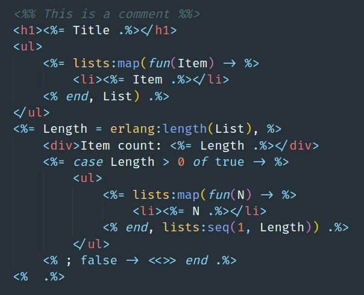

# VSCode Embedded Erlang - EEl

[Embedded Erlang (EEl)](https://github.com/williamthome/eel) support for Visual Studio Code.

## Features

### Syntax Highlighting

Syntax highlighting for `.html.eel` files.

## Requirements

An extension that provides syntax highlighting for Erlang code is required.\
Known compatible extensions:
- [erlang](https://marketplace.visualstudio.com/items?itemName=pgourlain.erlang)
- [Erlang LS](https://marketplace.visualstudio.com/items?itemName=erlang-ls.erlang-ls)